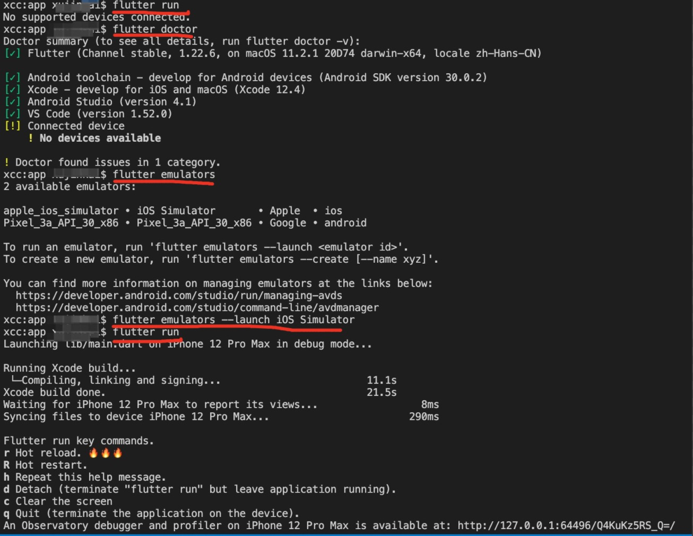

# 运行 flutter run 出现错误：No supported devices connected

在通过`flutter run`启动项目的过程中，遇到提示`No supported devices connected`的错误，错误的意思为没有找到连接的设备

## 解决方案

1. 运行`flutter doctor`，查看设备情况

```
flutter doctor
```

2. 运行`flutter emulators`，查看可连接设备

```
flutter emulators
```

3. 运行`flutter emulators --launch <emulator id>`，连接到指定设备，此时会打开一个模拟器

```
// mac端
flutter emulators --launch iOS Simulator
// windows
flutter emulators --launch Pixel_3a_API_30_x86
```

4. 运行`flutter run`，启动项目，正常运行

```
flutter run
```


