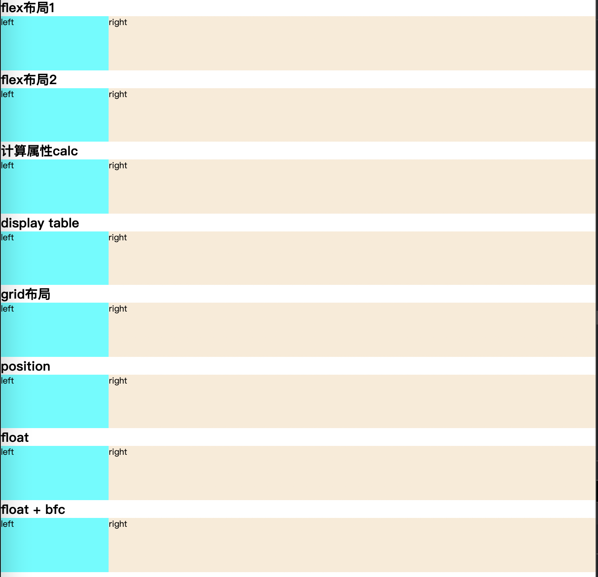

# CSS左侧固定，右侧自适应布局

## 效果预览



## 7中常见实现方式

### flex

```css
.item-1 {
  display: flex;
}
.item-1 .left {
  width: 200px;
}
.item-1 .right {
  flex: 1;
}
```

```css
.item-2 {
  display: flex;
}
.item-2 .left {
  flex-basis: 200px;
}
.item-2 .right {
  flex-grow: 1;
}
```

### calc属性

```css
.item-3 .left {
  float: left;
  width: 200px;
  height: 100%;
}
.item-3 .right {
  float: right;
  width: calc(100% - 200px);
  height: 100%;
}
```

### display table

```css
.item-4 {
  display: table;
  width: 100%;
}
.item-4 .left {
  display: table-cell;
  width: 200px;
}
.item-4 .right {
  display: table-cell;
}
```

### grid布局

```css
.item-5 {
  display: grid;
  grid-template-columns: 200px auto;
}
```

### position

```css
.item-6 {
  position: relative;
  overflow: hidden;
}
.item-6 .left {
  position: absolute;
  width: 200px;
  height: 100%;
}
.item-6 .right {
  margin-left: 200px;
  height: 100%;
}
```

### float

```css
.item-7 .left {
  float: left;
  width: 200px;
  height: 100%;
}
.item-7 .right {
  margin-left: 200px;
  height: 100%;
}
.item-7:after{
  content: '';
  height: 0;
  line-height: 0;
  display: block;
  visibility: hidden;
  clear: both;
}
```

### float + bfc

```css
.item-8 .left {
  float: left;
  width: 200px;
  height: 100%;
}
.item-8 .right {
  overflow: hidden;
  height: 100%;
}
.item-8:after {
  content: '';
  height: 0;
  line-height: 0;
  display: block;
  visibility: hidden;
  clear: both;
}
```

## 完整代码

```html
<!DOCTYPE html>
<html lang="en">
<head>
  <meta charset="UTF-8">
  <meta http-equiv="X-UA-Compatible" content="IE=edge">
  <meta name="viewport" content="width=device-width, initial-scale=1.0">
  <title>左侧固定，右侧自适应布局</title>
</head>
<style>
  * {
    margin: 0;
    padding: 0;
  }
  .item {
    height: 100px;
  }
  .left {
    background-color: aqua;
  }
  .right {
    background-color: antiquewhite;
  }
</style>
<style>
  .item-1 {
    display: flex;
  }
  .item-1 .left {
    width: 200px;
  }
  .item-1 .right {
    flex: 1;
  }
</style>
<style>
  .item-2 {
    display: flex;
  }
  .item-2 .left {
    flex-basis: 200px;
  }
  .item-2 .right {
    flex-grow: 1;
  }
</style>
<style>
  .item-3 .left {
    float: left;
    width: 200px;
    height: 100%;
  }
  .item-3 .right {
    float: right;
    width: calc(100% - 200px);
    height: 100%;
  }
</style>
<style>
  .item-4 {
    display: table;
    width: 100%;
  }
  .item-4 .left {
    display: table-cell;
    width: 200px;
  }
  .item-4 .right {
    display: table-cell;
  }
</style>
<style>
  .item-5 {
    display: grid;
    grid-template-columns: 200px auto;
  }
</style>
<style>
  .item-6 {
    position: relative;
    overflow: hidden;
  }
  .item-6 .left {
    position: absolute;
    width: 200px;
    height: 100%;
  }
  .item-6 .right {
    margin-left: 200px;
    height: 100%;
  }
</style>
<style>
  .item-7 .left {
    float: left;
    width: 200px;
    height: 100%;
  }
  .item-7 .right {
    margin-left: 200px;
    height: 100%;
  }
  .item-7:after{
    content: '';
    height: 0;
    line-height: 0;
    display: block;
    visibility: hidden;
    clear: both;
  }
</style>
<style>
  .item-8 .left {
    float: left;
    width: 200px;
    height: 100%;
  }
  .item-8 .right {
    overflow: hidden;
    height: 100%;
  }
  .item-8:after {
    content: '';
    height: 0;
    line-height: 0;
    display: block;
    visibility: hidden;
    clear: both;
  }
</style>
<body>
  <div class='container'>
    <h2>flex布局</h2>
    <div class='item item-1'>
      <div class='left'>left</div>
      <div class='right'>right</div>
    </div>
    <h2>flex布局</h2>
    <div class='item item-2'>
      <div class='left'>left</div>
      <div class='right'>right</div>
    </div>
    <h2>计算属性calc</h2>
    <div class='item item-3'>
      <div class='left'>left</div>
      <div class='right'>right</div>
    </div>
    <h2>display table</h2>
    <div class='item item-4'>
      <div class='left'>left</div>
      <div class='right'>right</div>
    </div>
    <h2>grid布局</h2>
    <div class='item item-5'>
      <div class='left'>left</div>
      <div class='right'>right</div>
    </div>
    <h2>position</h2>
    <div class='item item-6'>
      <div class='left'>left</div>
      <div class='right'>right</div>
    </div>
    <h2>float</h2>
    <div class='item item-7'>
      <div class='left'>left</div>
      <div class='right'>right</div>
    </div>
    <h2>float + bfc</h2>
    <div class='item item-8'>
      <div class='left'>left</div>
      <div class='right'>right</div>
    </div>
  </div>
</body>
</html>
```