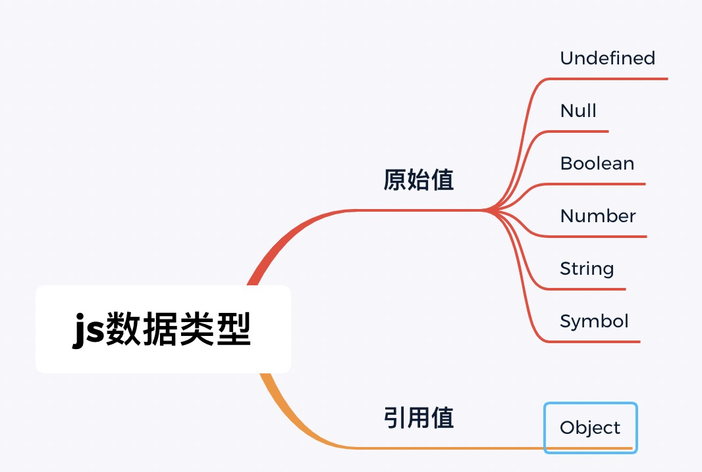

# js数据类型

## js数据类型分类：原始值/引用值

js包含两种不同的数据类型，原始值与引用值



> 原始值

- 原始值是按值访问的
- 原始值是存放在栈中

> 引用值

- 按照引用访问的
- 引用值存放在内存中，js不予许直接访问内存，因此不能直接操作对象所在的内存空间，实际操作对象时，操作的是对象的引用而非对象本身

### 原始值与引用值的几个常见知识点

> 动态属性

- 原始值不能有属性，不过给原始值添加属性也不会报错
- 引用值可以随时添加，修改，删除其属性

```javascript
// 原始值
var a = 10
a.name = 'xcc'
console.log(a.name) // undefined
```

```javascript
// 引用值
var obj = new Object()
obj.name = 'xcc'
console.log(obj.name) // xcc
```

> 复制

- 原始值的复制会产生一个新的原始值
- 引用值在复制时只是复制了引用值的指针

```javascript
let a = 10
let b = a
a = 20
console.log(b)  // 10
```

```javascript
let obj = new Object()
let obj1 = obj
obj.name = 'xcc'
console.log(obj1.name)  // xcc
```

<p>引用值的复制可能存在的问题？</p>

- 很多的内部逻辑可能会在不经意间改变了初始对象的内容

```javascript
let obj = { name: 'xcc' }
function test(o) {
  o.name = 'jack'
}
test(obj)
console.log(obj)  // { name: 'jack' }
```

> 传递参数

- ECMAScript中函数的传参都是按照值传递的，函数外的值都会被复制到函数内部的参数中
- 原始值与引用值的传递就是先被复制到一个局部变量，然后把局部变量传递到函数中

```javascript
let age = 20, obj = { name: 'xcc' }
function test(age, o) {
  // 代码逻辑
}
test(age, obj)

// 等价于
let age = 20, obj = { name: 'xcc' }
let age1 = age
let obj1 = obj
function test(age, o) {
  // 代码逻辑
}
test(age1, obj1)
```

```javascript
let age = 20
function test(age) {
  return age + 10
}
let age1 = test(age)
console.log(age, age1)  // 20 30
```

```javascript
let obj = { age: 20 }
function test(o) {
  o.age = 30
  return o
}
let obj1 = test(obj)
// 引用值在作为参数传递时，会对函数外部有影响
console.log(obj, obj1)  // { age: 30 }  { age: 30 }
```

## 常见数据类型的特点

### Undefined

- Undefined类型只有一个值，就是特殊值undefined
- 通过var/let声明的变量在初始化时默认值为undefined
- 值为undefined的变量与未定义的变量有区别
- 未初始化的变量与未定义的变量在调用typeof方法是，返回结果都为undefined(说明通过typeof判断时不准确)

```javascript
var a
let b
console.log(a, b) // undefined undefined
```

```javascript
var a
console.log(a)  // undefined
console.log(b)  // 报错
```

```javascript
var a
console.log(typeof a) // undefined
console.log(typeof b) // undefined
```

### Null

- Null类型只有一个特殊值null，null值表示一个空对象指针
- 初始化变量时一般通过null赋值，而不是赋值为undefined
- undefined值是由null派生过来的

```javascript
console.log(typeof null)  // object
```

```javascript
let age = null
```

```javascript
console.log(null == undefined)  // true
```

### Boolean

- Boolean有两个字面值true/false
- 布尔值与其他类型的值可以通过Boolean()函数进行转换

```javascript
console.log(Boolean('xcc')) // true
console.log(Boolean(20)) // true
console.log(Boolean({})) // true
console.log(Boolean('')) // false
console.log(Boolean(null)) // false
console.log(Boolean(undefined)) // false
console.log(Boolean(NaN)) // false
```

### Number

- Number类型采用IEEE 754格式表示整数和浮点数
- 整数可以通过十进制，八进制，十六进制，二进制表示
- 浮点值使用的存储空间是整数值的两倍
- 浮点值的精确度数为17位，但是在计算中不如整数精确
- Number类型值的范围是Number.MIN_VALUE-Number.MAX_VALUE
- 特殊值NaN
- 数值转换方法Number()，parseInt()，parseFloat()

```javascript
console.log(0.1 + 0.2 === 0.3)  // false
```

```javascript
console.log(0/0)  // NaN
console.log(NaN === NaN)  // FALSE
```

```javascript
console.log(isNaN(NaN)) // true
console.log(isNaN(10))  // false
console.log(isNaN('xcc')) // true
```

### String

- String类型表示零个或者多个16位Unicode字符序列
- 字符串的特点是一旦创建了就不可被修改
- 字符串的转换toString()，null与undefined没有该方法
- es6新增的模板字符拼接方法

```javascript
// 先创建9个字符的空间存放hello xcc，然后销毁原始字符串hello和 xcc
let a = 'hello'
a = a + ' xcc'
```

```javascript
let a = 10
let b = true
console.log(a.toString()) // 10
console.log(b.toString()) // 'true'
console.log(10.toString())  // Invalid or unexpected token
console.log(10 .toString()) // 10
console.log(null.toString())  // Cannot read property 'toString' of null
console.log(undefined.toString()) // Cannot read property 'toString' of undefined
```

```javascript
let name = 'xcc'
const str = `hello ${name}`
console.log(str)  // hello xcc
```

### Symbol

- 符号是原始值，且符号实例是唯一、不可变的。符号的用途是确保对象属性使用唯一标识符，不会发生属性冲突的危险
- Symbol()函数不能与new关键字一起作为构造函数使用

```javascript
let sym = Symbol()
console.log(typeof sym) // symbol
```

```javascript
let a = Symbol()
let b = Symbol()
let c = Symbol('xcc')
let c = Symbol('xcc')

console.log(a === b)  // false
console.log(c === d)  // false
```

```javascript
let sym = new Symbol()  // TypeError: Symbol is not a constructor
```

### Object

- constructor: 用于创建当前对象的函数
- hasOwnProperty(): 用于判断当前对象实例上是否存在给定的属性
- isPrototypeOf(object): 用于判断当前对象是否为另外一个对象的原型
- prototypeIsEnumerable(): 用于判断给定的属性是否可以使用
- toLocaleString(): 返回对象的字符串表示，该字符串反映对象所在的本地化执行环境
- toString(): 返回对象的字符串表示
- valueOf(): 返回对象的字符串，数值，布尔值表示
