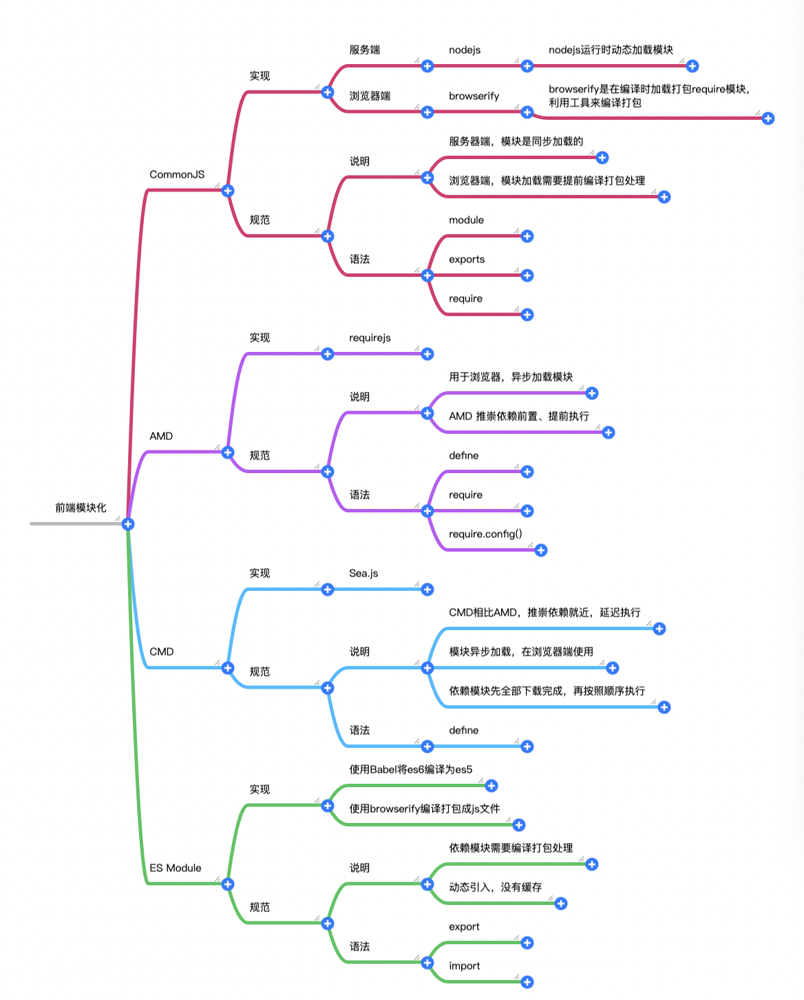

# 前端模块化



## CommonJS

- nodejs使用的规范
- 文件即模块，通过指定的方式进行导出
- `/`表示通过绝对路径来加载模块，`./`表示通过相对路径来加载模块
- 模块加载会有缓存存在，存放在`require.cache`中，并且缓存是根据绝对路径来识别的
- `CommonJS`是同步加载的，加载完成之后再进行下面的操作
- `运行时加载，CommonJS就是对象，在输入时先加载整个模块，生成一个对象，然后在从这个对象上面读取方法`
- `CommonJS输出的是值拷贝，一旦输出一个值，模块内部变化不会影响这个值`

```javascript
// a.js
function test1() {
  console.log('test 1')
}
function test2() {
console.log('test 2')
}

// 通过module.exports导出模块
module.exports = {
  test1,
  test2
}

// 或者
module.exports = test1

// 通过exports导出模块
exports.fn = test1

// b.js
// 通过require来加载模块

// 核心模块加载
const http = require('http')

// 加载module.exports导出的模块
const { test1, test2 } = require('./a')
test1() // test 1

// 加载exports导出的模块
const test = require('./a.js')
test.fn() // test 1
```

## AMD

- 采用异步方式加载模块，模块加载不影响后面的语句运行
- 存在依赖关系的模块，会在依赖的模块的回调函数中执行
- `requirejs`实现了AMD规范的模块化
- AMD推崇依赖前置，提前执行

```javascript
// 模块定义
/*
  id: 可选，定义模块表示
  dependencies: 当前模块依赖模块列表
  factory: 工厂方法，表示模块初始化需要执行的函数或者对象
*/
define(id?, dependencies, factory)

// 模块加载
/*
  dependencies: 需要加载的模块文件
  fn: 模块加载完成的回调
*/
require([dependencies], fn)
```

```javascript
// 定义
// a.js
define(['jquery'], function($) {
  function test() {
    console.log($('#app'))
  }
  return {
    test
  }
})

// 加载
// b.js
require(['a.js'], function(t) {
  t.test()
})
```

## CMD

- 通用模块定义
- 异步加载模块
- 依赖就近，延迟执行
- `seajs`实现了CMD规范的模块化

```javascript
// AMD实现
define(['a', 'b', 'c'], function(a, b, c) {
  // 在执行到回调函数中时，实际模块a，b，c已经都加载完成
  a.fn1()
  b.fn1()
  c.fn1()
})

// CMD实现
define(function(require, exports, module) {
  const a = require('./a')
  a.fn1()
  if (false) {
    const b = require('./b')
    b.fn1()
  }
})
```

## ES Module

- 通过es6的`语言标准`层面上实现模块功能，旨在成为浏览器与服务端通用的模块化解决方案
- `编译时加载，ES6模块不是对象，而是通过`export`命令显式指定输出代码。`import`是采用静态命令的形式，可以加载指定的某个输出值，而不是加载整个模块`
- 通过`export`来导出接口，通过`import`引入接口
- `js引擎对脚本静态分析时，遇到模块加载命令import，会输出一个只读的引用。等到脚本真正执行时，再取实际导出的值`

```javascript
// 定义模块
// a.js
function test1() {
  console.log('test 1')
}

export {
  test1
}

// b.js
function test2() {
  console.log('test 2')
}

function test3() {
  console.log('test 3')
}

export default {
  test2,
  test3
}

// 引入模块
// c.js
import { test1 } from './a'
import math from './b'
test1()
math.test2()
```

```javascript
// a.js
function func() {
  console.log('func a')
}

function bar() {
  console.log('bar')
}

// b.js
function func() {
  console.log('func b')
}

import React from 'react'
// 在import时使用as来区分别名
import { func as fu, bar } from './a'
import { func } from './a'

export class MyClass extends React.Component {
    ...
}
```

```javascript
// 通过export default指定默认输出
// a.js
export default function() {
  console.log('test 1')
}
// b.js
export function test2() {
console.log('test 2')
}
// c.js
import Test1 from './a'
import { Test2 } from '/b'
```

```javascript
// 浏览器中直接使用，通过type='module'来识别es6模块
// a.js
const name = 'xcc'
export default xcc

// index.html
<script type="module">
  import name from './a.js'
  console.log(name) // xcc
</script>
```

## 注意的点

```javascript
// CommonJS加载
// 基本数据类型导出后不可修改，为复杂数据类型时，实际是一个浅拷贝，可以进行修改
// a.js
let name = 'xcc'
let obj = { name: 'xcc', age: 20 }

function setName() {
  name = 'xcc1'
}

function setName1() {
  obj.name = 'xcc2'
}

module.exports = {
  name,
  info: obj,
  setName,
  setName1
}

// b.js
let { name, info, setName, setName1 } = require('./a.js')

setName()
setName1()

console.log(name, info) // xcc { name: 'xcc2', age: 20 }
```

```javascript
// ES Module
// 导出后还可以随便修改
// c.js
let name = 'xcc'
let obj = { name: 'xcc', age: 20 }

function setName() {
  name = 'xcc1'
}

function setName1() {
  obj.name = 'xcc2'
}

export {
  name,
  obj,
  setName,
  setName1
}

// index.html
<script type="module">
  import { name, obj, setName, setName1 } from './c.js'
  setName()
  setName1()
  console.log(name, obj)  // xcc1 {name: "xcc2", age: 20}
</script>
```

## 参考资料

- [ES6入门-阮老师](https://es6.ruanyifeng.com/#docs/module-loader)
- [github查看更多文章](https://github.com/xccjk/x-blog)
